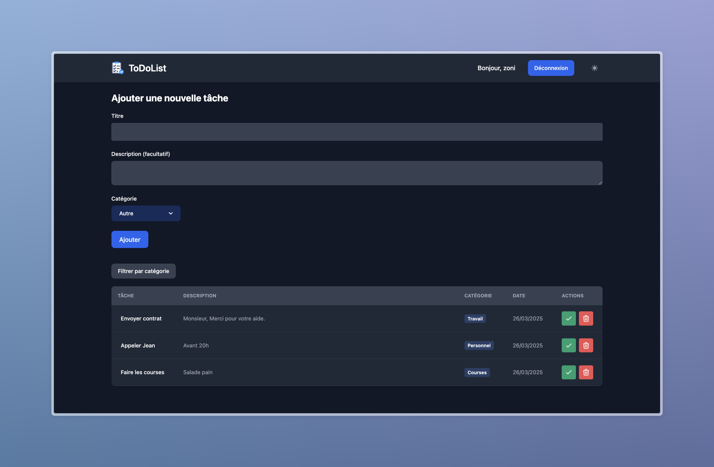

# ToDoList Application

A modern task management application built with React, Node.js, and MongoDB.

## 📸 Screenshot



## 🚀 Features

- User authentication (register/login)
- Task management (create, read, update, delete)
- Dark/Light theme support
- Responsive design
- Docker containerization

## 🛠 Tech Stack

### Frontend
- React with TypeScript
- Vite
- TailwindCSS
- Flowbite React components

### Backend
- Node.js
- Express
- MongoDB
- JWT Authentication

## 📦 Project Structure

```
ToDoList/
├── frontend/          # React frontend application
├── backend/           # Node.js backend API
├── docker-compose.yml # Docker composition file
└── .env              # Environment variables
```

## 🚦 Getting Started

### Prerequisites
- Docker and Docker Compose
- Make
- Node.js (for local development)

### Installation

1. Clone the repository
```bash
git clone https://github.com/yourusername/ToDoList.git
cd ToDoList
```

2. Create .env file in the root directory with required variables:
```properties
# Application
NODE_ENV=development
APP_NAME=ToDoList

# Ports
FRONTEND_PORT=4242
BACKEND_PORT=3000

# URLs
API_URL=http://backend:${BACKEND_PORT}
FRONTEND_URL=http://frontend:${FRONTEND_PORT}
MONGODB_URI=mongodb://mongodb:27017/todolist

# Variables pour Vite (Frontend)
VITE_API_URL=${API_URL}
```

3. Build and start the application using Make commands:
```bash
# Build all containers
make build

# Start the application
make up

# Stop the application
make down

# View logs
make logs

# Rebuild and restart specific service
make rebuild service=frontend
```

The application will be available at:
- Frontend: http://localhost:4242
- Backend API: http://localhost:3000
- MongoDB: mongodb://localhost:27017
